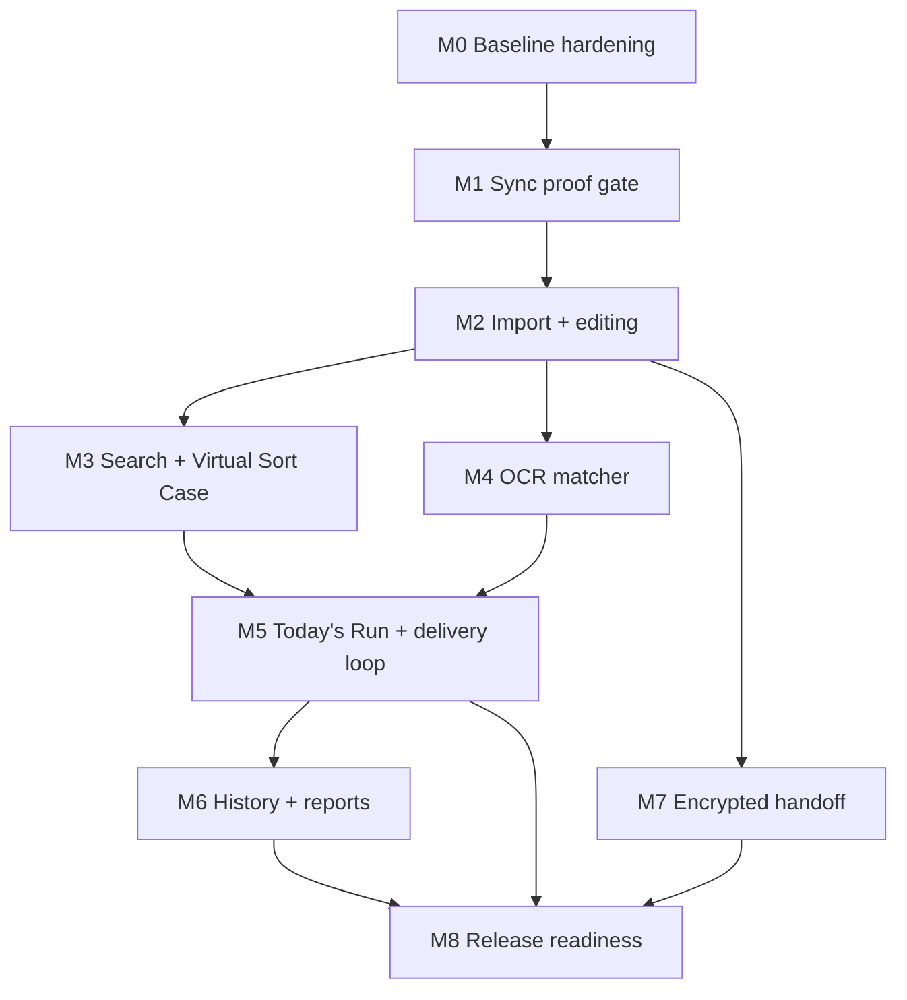

# Routey Roadmap Execution Plan

> **For agentic workers:** REQUIRED SUB-SKILL: Use superpowers:subagent-driven-development (recommended) or superpowers:executing-plans to implement this plan task-by-task. Steps use checkbox (`- [ ]`) syntax for tracking.

**Goal:** Sequence the V1.0 Routey roadmap into gated milestones that preserve the offline-first source-of-truth model, prove the SQLiteData + CloudKit architecture before feature work depends on it, and keep every milestone independently verifiable.

**Architecture:** This plan is the execution spine over the existing detailed plans in `docs/superpowers/plans/2026-06-22-routey-01-foundation.md` through `2026-06-22-routey-07-encrypted-handoff.md`. The deepest risk stays first: prove the synced graph on two physical devices, then build import/editing, derived search, OCR matching, Today's Run, history/reports, and encrypted handoff in that dependency order.

**Tech Stack:** Swift 6, SwiftUI, SQLiteData/GRDB, private CloudKit, Vision, CryptoKit/CommonCrypto, Swift Testing, PDF/AirPrint in the iOS app shell.

## Global Constraints

- Routey is carrier-agnostic: never commit employer names, real route data, real street/site/place names, civic numbers, or carrier-specific jargon.
- Routey is offline-first: local SQLite is the source of truth; sync is background backup/multi-device and never blocks UI.
- App target: iOS 18.0. `RouteyKit` package floor: iOS 17 / macOS 14 so `swift test` runs on Mac.
- Persistence is SQLiteData + GRDB + private CloudKit; do not introduce SwiftData/Core Data unless the sync proof fails and the fallback decision is made.
- Synced schema is append-only once sync is live: UUID primary keys, no non-primary-key `UNIQUE`, no rename/drop/retype, and only allowed FK actions for sync.
- Shared state for SwiftUI should use `@Observable` and `@MainActor`; keep business logic in `RouteyDomain` or view models, not view bodies.
- Unit tests use Swift Testing, not XCTest.
- Existing baseline as of this plan: `RouteyKit` has `RouteyModel` + `RouteyPersistence`, v1 schema tables, and 3 passing Swift Testing tests.

---

## Milestone Overview

| Milestone | Depends on | Deliverable | Gate |
|---|---|---|---|
| M0 Baseline hardening | Current worktree | Foundation package is clean, schema rules are audited, docs match current implementation | `cd RouteyKit && swift test` green |
| M1 Sync proof gate | M0 | Throwaway Mac+iPhone SQLiteData + CloudKit graph proof | Explicit proceed/fallback decision |
| M2 Import + master-route editing | M1 | Route parser, importer, edit operations, iOS route list/edit/import screens | Parser/import/edit tests green; UI works offline |
| M3 Search + Virtual Sort Case | M2 | Local FTS5 index, predictive search, virtual sort-case UI | FTS rebuild/search tests green |
| M4 OCR matcher | M2, feeds M5 | Vision label reader, deterministic address matcher, keyword detection | Fixture matcher/OCR tests green |
| M5 Today's Run + delivery loop | M2, M3, M4 | Daily run generation, parcels, signatures, outcomes, follow-ups, proof records, Snap-to-Add UI | Domain tests green; truck-loop smoke test |
| M6 History + reports | M5 | Archived runs, searchable delivery history, report builder, PDF/print/share | Archive/search/report tests green |
| M7 Encrypted handoff | M2, M6 optional for content | Versioned `.routey` export/import, borrowed read-only routes | Crypto round-trip and tamper tests green |
| M8 Release readiness | M1-M7 | App Store-ready V1.0 iPhone cut | Package/app tests, CloudKit Production schema check, privacy/security review |

## Dependency Graph



## M0: Baseline Hardening

**Purpose:** Make the current foundation safe enough to become the base for the sync proof.

**Primary source plans:** `2026-06-22-routey-01-foundation.md`.

**Work:**
- [x] Confirm all `@Table` structs are `nonisolated` or otherwise accepted under strict Swift 6 concurrency.
- [x] Audit v1 schema against SQLiteData sync limits: UUID primary keys, no synced non-PK uniqueness, allowed FK cascade actions, table names matching SQLiteData derivation.
- [x] Add missing schema tests before expanding the graph: FK enforcement, table column lists, UUID encoding assumptions, and idempotent fresh-install migration behavior.
- [x] Decide whether `Tag` should keep UUID primary keys or promote canonical name to primary key before sync goes live. Decision: keep UUID primary keys; enforce canonical-name reuse in app/domain logic.
- [x] Update design/plans if the implemented schema intentionally diverges from the spec.

**Verification:**
```bash
cd RouteyKit && swift test
cd RouteyKit && swift test --filter SchemaTests
cd RouteyKit && swift test --filter CRUDTests
cd RouteyKit && swift test --filter CascadeTests
```

**Exit criteria:**
- Package tests are green.
- Schema rules are documented.
- Any pre-sync schema corrections are made before the two-device proof.

## M1: Sync Proof Gate

**Purpose:** Decide whether SQLiteData + private CloudKit is viable before building user-facing workflows on it.

**Selected proof path:** Mac+iPhone proof. The macOS proof client is temporary
and exists only to validate one-account, two-device CloudKit propagation with
one physical iPhone available. Before beta/release, run an iOS-to-iOS smoke
check if a second iPhone becomes available.

**Primary source plans:** `2026-06-22-routey-01-foundation.md`.

**Work:**
- [x] Create the thin iOS app shell and wire local database startup.
- [x] Configure private CloudKit sync for the full v1 graph: Route -> Stop -> Module -> DeliveryPoint -> Address plus DeliveryPointAddress, Tag, and AddressTag.
- [x] Add a temporary macOS proof client that seeds invented, carrier-agnostic test data only.
- [ ] Install on one physical iPhone and one signed Mac app using the same iCloud account.
- [ ] Verify parent-before-child arrival, cascade deletes, many-to-many joins, and a concurrent reorder using `sortIndex`.
- [x] Record an explicit decision: proceed with SQLiteData or pivot to Core Data + `NSPersistentCloudKitContainer`.

**Status 2026-06-25:** Local M1 setup is complete in the app shell. `RouteyApp`
now opens the local database and starts a private-only SQLiteData `SyncEngine`
for the eight v1 synced tables. The app target has CloudKit entitlements,
remote-notification background mode, and a verified simulator build.

**Status 2026-06-25, Mac+iPhone path:** `RouteyMacProof` is added as a macOS
proof app target. It uses the same `routeySyncEngine(for:)` table list and the
same private CloudKit container as the iOS app, can seed an invented full graph,
push, pull, sync, move a proof stop with `sortIndex`, and delete its proof data.
The scheme is visible to Xcode and compiles with signing disabled. A signed Mac
build is currently blocked because the available "Mac Team Provisioning Profile:
*" does not include the iCloud capability or `iCloud.com.routey.app` container.
The actual CloudKit round-trip needs a Mac app ID/provisioning profile with that
container, plus the iPhone signed into the same iCloud account.

**Status 2026-06-28:** PR #13 merged to `nightly` as `54f9ceb` (`Add
foreground Routey sync hooks (#13)`), and GitHub's Build gate + tests passed in
14m13s. The currently documented manual proof covers a physical iPhone clean
reinstall whose database matched the Mac proof database's invented placeholder
proof rows, with no unsynced rows observed. This proves the documented
clean-install pull path and supports proceeding with SQLiteData + private
CloudKit unless the remaining manual matrix reveals a hard failure. The evidence
does not explicitly document that the signed Mac app install was unblocked, so
that checklist item remains open.

The synced schema is now under append-only discipline: preserve UUID primary
keys, avoid non-primary-key uniqueness on synced tables, and add only new
optional/defaulted synced columns or new synced tables instead of renaming,
dropping, or retyping existing synced schema.

Remaining manual matrix follow-up: the repo does not yet document every graph
edge independently. Signed Mac app install evidence, nested iPhone edit -> Mac
pull, Mac `sortIndex` move -> iPhone pull, delete/cascade propagation, and
same-row or concurrent reorder behavior remain manual checks. Until the reorder
behavior is documented, Today's Run stays single-device-per-day.

**Verification:**
```bash
cd RouteyKit && swift test
cd RouteyKit && swift build
xcodebuild -project app/Routey/Routey.xcodeproj -scheme Routey -destination 'generic/platform=iOS Simulator' build
xcodebuild -project app/Routey/Routey.xcodeproj -scheme RouteyMacProof -destination 'platform=macOS' CODE_SIGNING_ALLOWED=NO build
```

Once the app target exists, use a single capped build/test invocation:
```bash
xcodebuild -scheme Routey -destination 'platform=iOS Simulator,name=iPhone 16' -parallel-testing-enabled NO test
```

For simulator/device logs when diagnosing sync:
```bash
/Users/dfakkeldy/.codex/plugins/cache/axiom-marketplace/axiom/27.0.0-beta.9/bin/xclog list
/Users/dfakkeldy/.codex/plugins/cache/axiom-marketplace/axiom/27.0.0-beta.9/bin/xclog launch <bundle-id> --timeout 30s --max-lines 200
```

Manual Mac+iPhone gate:
- [x] Mac proof database has invented placeholder proof rows; a clean reinstall iPhone receives matching rows with no unsynced rows observed.
- [ ] iPhone edits nested rows; Mac proof app pulls and reflects the changes.
- [ ] Mac proof app moves a proof stop and pushes it; iPhone reflects the `sortIndex` reorder.
- [ ] One side deletes the proof route; owned rows cascade consistently on the other side.
- [ ] If both sides reorder different stops, the result is understandable under last-write-wins and gap indexing.

**Exit criteria:**
- Written proceed/fallback decision.
- If proceed: schema becomes append-only discipline.
- If fallback: replace the persistence implementation plan before continuing.

## M2: Import + Master-Route Editing

**Purpose:** Get a living route into Routey and make it editable offline.

**Primary source plans:** `2026-06-22-routey-02-import-editing.md`.

**Work:**
- [x] Add `RouteyImport` for tolerant pasted/CSV route parsing.
- [x] Add `RouteyDomain` edit operations for stops, addresses, tags, and gap-based stop ordering.
- [ ] Add remaining route and delivery-point edit operations.
- [x] Build in-memory database tests for parser -> importer -> persisted graph.
- [x] Add iOS Route List, Stop Detail, Address Editor, Tag Picker, and Import screens.
- [x] Keep all UI state in `@MainActor @Observable` view models or view-owned `@State`; database/domain logic remains outside views.

**Verification:**
```bash
cd RouteyKit && swift test --filter RouteParserTests
cd RouteyKit && swift test --filter RouteImporterTests
cd RouteyKit && swift test --filter RouteEditingTests
cd RouteyKit && swift test
```

App smoke checks:
- Launch in airplane mode.
- Import invented route data.
- Add, edit, reorder, tag, and delete entries.
- Relaunch and confirm local data remains available.

**Exit criteria:**
- A route can be built and maintained without network.
- Editing operations are covered without simulator dependency.

## M3: Search + Virtual Sort Case

**Purpose:** Answer "is this on my route?" and "where does it go?" instantly.

**Primary source plans:** `2026-06-22-routey-03-search-sortcase.md`.

**Work:**
- [x] Add `RouteySearch` and local, non-synced FTS5 tables.
- [x] Build deterministic FTS rebuild from the master graph.
- [x] Add `SearchService` returning ranked hits with locator details.
- [x] Wire rebuild after import/edit operations and at app launch if needed.
- [x] Build predictive Search UI.
- [ ] Build Virtual Sort Case UI.

**Status 2026-06-28:** `cd RouteyKit && swift test` passes with 31 Swift
Testing tests in 9 suites. M2 is implemented for tolerant import, importer
persistence, stop/address/tag editing, gap stop ordering, and the route/import
editing screens; remaining M2 gaps are full route and delivery-point edit
operations plus refreshed offline app smoke evidence. M3 is implemented for the
local FTS5 index, deterministic rebuild, located `SearchService` hits,
import/edit/app-launch rebuild wiring, and predictive Search UI; remaining M3
gaps are Virtual Sort Case UI and any tag-term query matching required by the
smoke checklist.

**Verification:**
```bash
cd RouteyKit && swift test --filter SearchIndexTests
cd RouteyKit && swift test --filter SearchServiceTests
cd RouteyKit && swift test
```

App smoke checks:
- Search by civic-like placeholder, street placeholder, occupant placeholder, tag, and shared-slot case.
- Edit source data and confirm derived search results update.
- Rebuild FTS from scratch and confirm identical results.

**Exit criteria:**
- Search is local-only, fast, and derived data can be rebuilt freely.
- Virtual Sort Case shows shared delivery points and warning flags without duplicating source truth.

## M4: OCR Matcher

**Purpose:** Turn label text into ranked route candidates without network dependence.

**Primary source plans:** `2026-06-22-routey-04-ocr-matcher.md`.

**Work:**
- [x] Add `RouteyOCR` with a pure `AddressNormalizer`.
- [x] Add `AddressMatcher` using normalize -> block -> weighted score -> rank -> threshold.
- [x] Add gated numeric agreement: confident mismatched numbers disqualify candidates.
- [x] Add occupant-name disambiguation for shared civics.
- [x] Add keyword detection for signature/customs-style handling.
- [x] Wrap label reading behind a testable boundary; the first shipped slice uses fixture text input, not camera UI.
- [x] Assemble `SnapPipeline` for Plan 05 consumption.

**Status 2026-06-28:** PR #15 merged to `nightly` as `a0db96f` (`Add
Routey OCR matcher core (#15)`). The merged headless slice adds the
`RouteyOCR` target, deterministic normalization/matching, conservative numeric
mismatch handling, occupant disambiguation, invented keyword fixtures, a
`LabelReading` protocol boundary, and `SnapPipeline`. Camera/Vision UI remains
deferred.

**Verification:**
```bash
cd RouteyKit && swift test --filter AddressNormalizerTests
cd RouteyKit && swift test --filter AddressMatcherTests
cd RouteyKit && swift test --filter LabelKeywordTests
cd RouteyKit && swift test --filter SnapPipelineTests
cd RouteyKit && swift test
```

Device/simulator checks once camera/OCR UI exists:
- Recognize fixture label images.
- Confirm auto-accept, disambiguation list, and manual fallback bands.
- Confirm OCR never silently assigns low-confidence matches.

**Exit criteria:**
- Matcher is deterministic, tested headlessly, and conservative on ambiguity.
- Vision is an input adapter, not the matching source of truth.

## M5: Today's Run + Delivery Loop

**Purpose:** Ship the core truck workflow: generate, load, reorder, deliver, and log.

**Primary source plans:** `2026-06-22-routey-05-todays-run.md`.

**Work:**
- [x] Add daily synced tables for runs, run stops, parcels, delivery records, and follow-up tasks.
- [x] Snapshot run stops from the master route so in-progress days survive master edits.
- [x] Implement run generation, gap-index reorder, parcel add, signature counts, delivery outcomes, follow-up spawning, and bulk check-off in `RouteyDomain`.
- [ ] Add Today's Run screen filters: full route, no-flyers + parcels, parcels, signatures.
- [ ] Add Deliver flow with GPS/timestamp and optional photo file reference.
- [ ] Add Snap-to-Add UI using `SnapPipeline`.
- [ ] Add scannable barcode re-display if still a Day-1 requirement.

**Status 2026-06-28:** PR #16 merged to `nightly` as `fa2f937` (`Add
Today's Run domain core (#16)`). The merged package slice adds the v2 daily
schema and synced tables, route snapshot generation, reorder/parcel/signature
operations, delivery logging with optional location/photo references, follow-up
tasks, and bulk check-off. The visible Today's Run app screens are still gated
behind explicit UI confirmation.

**Verification:**
```bash
cd RouteyKit && swift test --filter RunGenerationTests
cd RouteyKit && swift test --filter RunOperationTests
cd RouteyKit && swift test --filter DeliveryLoggingTests
cd RouteyKit && swift test --filter FollowUpTaskTests
cd RouteyKit && swift test
```

App smoke checks:
- Generate today's run offline.
- Add parcels manually and by snap.
- Reorder stops and confirm only affected sort indexes change.
- Log delivery outcomes, failed signature follow-up, photo reference, and last-stop bulk check-off.
- Relaunch offline and confirm the day state persists.

**Exit criteria:**
- The full sort -> snap -> deliver loop works offline.
- Today's Run remains single-device-per-day by product rule to avoid ordered-sync conflicts.

## M6: History + Reports

**Purpose:** Preserve delivery intelligence and regenerate route artifacts.

**Primary source plans:** `2026-06-22-routey-06-history-reports.md`.

**Work:**
- [x] Archive completed runs into searchable history.
- [x] Add filtered history queries by address, date, tag, outcome, and photo presence.
- [x] Add a pure `ReportBuilder` for tie-out sheets, case strips, and filtered lists.
- [ ] Render reports to PDF and expose print/share in the iOS app.
- [ ] Prefer SwiftUI `ImageRenderer` where rendering SwiftUI content; keep UIKit-only rendering behind `#if os(iOS)` if lower-level PDF APIs are required.

**Status 2026-06-28:** PR #17 merged to `nightly` as `b295ee3` (`Add Routey
history domain (#17)`), and PR #18 merged as `d79758d` (`Add Routey report
builder (#18)`). The merged headless slices cover archival, filtered delivery
history, address-query history via the search index, tie-out sheets, case
strips, and filtered report content. PDF, print, and share UI remain deferred.

**Verification:**
```bash
cd RouteyKit && swift test --filter HistoryArchiveTests
cd RouteyKit && swift test --filter HistorySearchTests
cd RouteyKit && swift test --filter ReportBuilderTests
cd RouteyKit && swift test
```

App smoke checks:
- Complete and archive a run.
- Search history by invented address/tag/outcome.
- Generate each report type.
- Preview, share, and AirPrint a PDF from device/simulator.

**Exit criteria:**
- History is queryable offline.
- Reports are generated from current local truth, not manually maintained data.

## M7: Encrypted Handoff

**Purpose:** Make `.routey` the sole relief-carrier handoff path, with imported routes borrowed/read-only.

**Primary source plans:** `2026-06-22-routey-07-encrypted-handoff.md`.

**Work:**
- [x] Add `RouteyExport` with Codable DTOs separate from persistence models.
- [x] Implement versioned envelope: magic `RTYE`, format version, KDF ID, PBKDF2 iteration count, salt, nonce, payload schema version, and GCM AAD binding.
- [x] Use AES-256-GCM and wrong-passphrase authentication failure as the only verifier.
- [x] Add borrowed/read-only route flag before sync live if possible; otherwise additive migration only.
- [ ] Add export/import UI via custom `.routey` UTType and file/transfer affordances.
- [x] Ensure no plaintext route export path exists in V1.0.

**Status 2026-06-28:** PR #19 merged to `nightly` as `e5cc634` (`Add Routey
encrypted handoff domain (#19)`). The merged package slice adds `RouteyExport`,
authenticated encrypted envelopes, DTO mapping, encrypted export/import round
trips with fresh IDs, and an additive v3 `routes.isBorrowed` migration with
domain read-only guards for borrowed routes. File import/export UI remains
deferred.

**Verification:**
```bash
cd RouteyKit && swift test --filter CryptoEnvelopeTests
cd RouteyKit && swift test --filter RouteDTOTests
cd RouteyKit && swift test --filter RouteExportImportTests
cd RouteyKit && swift test
```

Security checks:
- Encrypt -> decrypt equality.
- Wrong passphrase fails.
- Header/payload tamper fails authentication.
- Imported route is read-only in domain operations and UI.
- Export fixture contains invented data only.

**Exit criteria:**
- Relief handoff works offline through an encrypted file.
- Borrowed routes cannot be accidentally edited as owned routes.

## M8: Release Readiness

**Purpose:** Convert the implemented roadmap into a shippable V1.0 iPhone cut.

**Work:**
- [x] Run full package and app tests.
- [x] Run SwiftLint if installed.
- [x] Audit privacy, file protection, photo storage, location usage strings, and CloudKit entitlements.
- [x] Verify all user-facing copy remains carrier-agnostic.
- [ ] Deploy CloudKit schema changes to Production and test against Production before release.
- [x] Confirm watchOS and CarPlay deferred fields remain present or intentionally optional.
- [ ] Update README/spec/plans to match shipped behavior.

**Status 2026-06-28:** Local release-readiness checks on the `nightly` train
passed for `RouteyKit` build/test, the current Routey app test target, and a
generic iOS app build. SwiftLint was not installed in the local environment.
The built app bundle uses `com.danfakkeldy.routey`, minimum iOS 18.0, and a
CloudKit entitlement for `iCloud.com.routey.app`. Current app code has no
active camera, photo library, or location APIs; photo paths and coordinates are
domain fields for deferred UI. Production CloudKit schema deployment,
Production-environment device testing, and the visible V1.0 app workflows
remain manual release gates.

**Verification:**
```bash
cd RouteyKit && swift test
cd RouteyKit && swift build
if command -v swiftlint >/dev/null; then swiftlint; fi
```

Once the app target exists:
```bash
xcodebuild -scheme Routey -destination 'platform=iOS Simulator,name=iPhone 16' -parallel-testing-enabled NO test
```

Manual release gates:
- Airplane-mode walkthrough of sort -> snap -> deliver -> history -> export.
- Two physical devices with same private iCloud store after Production schema deployment.
- Locked-phone/file-protection check before any CarPlay-facing build.
- App Store privacy answers match actual APIs and stored data.

**Exit criteria:**
- V1.0 iPhone app can be used without signal for the complete core workflow.
- Sync backup works without becoming part of the critical path.
- Production CloudKit schema is deployed and verified.

## Cross-Cutting Risk Areas

| Risk | Why it matters | Mitigation | Gate |
|---|---|---|---|
| SQLiteData + CloudKit maturity | Young library, last-write-wins only, ordered data can be clobbered | M1 two-device proof before feature build-out; single-device Today's Run | M1 proceed/fallback decision |
| Append-only synced schema | Rename/drop/retype becomes unsafe after sync live | Front-load schema review; add optional/defaulted future fields; local-only derived tables for FTS/OCR cache | M0/M1 schema audit |
| CloudKit Dev/Prod split | App Store build can silently see empty production data | Deploy schema changes and test Production environment before every release | M8 release gate |
| Ordered sync conflicts | Reorders from multiple devices can merge poorly | Fractional/gap `sortIndex`, one-row move writes, Today's Run single-device rule | M1 and M5 tests |
| OCR misassignment | A wrong parcel match is worse than manual entry | Numeric mismatch disqualification, confidence bands, undo/disambiguation/manual fallback | M4/M5 fixture and smoke tests |
| Derived search drift | FTS is local-only and can go stale after edits | Rebuild from graph, reindex after import/edit, launch-time repair path | M3 rebuild tests |
| Privacy and public repo safety | Route data is sensitive and repo is public | Invented fixtures only; no employer/real street/site/civic data in committed files | Every milestone review |
| Encryption mistakes | Handoff is the only sharing mechanism | Separate DTOs, authenticated header, tamper tests, no plaintext export | M7 crypto tests |
| File protection for future CarPlay | CarPlay may need DB while phone is locked | Pick storage/keychain accessibility deliberately before CarPlay work | M8 deferred-readiness check |
| SwiftUI logic creep | Truck UI must be fast and testable | Keep domain/view-model logic out of views; use `@Observable` state correctly | UI milestone reviews |

## Verification Command Index

Current known-green baseline:
```bash
cd RouteyKit && swift test
```

Package loop:
```bash
cd RouteyKit && swift build
cd RouteyKit && swift test
cd RouteyKit && swift test --filter <SuiteName>
```

App loop once the Xcode app target exists:
```bash
xcodebuild -scheme Routey -destination 'platform=iOS Simulator,name=iPhone 16' -parallel-testing-enabled NO build
xcodebuild -scheme Routey -destination 'platform=iOS Simulator,name=iPhone 16' -parallel-testing-enabled NO test
```

Simulator/device log capture:
```bash
/Users/dfakkeldy/.codex/plugins/cache/axiom-marketplace/axiom/27.0.0-beta.9/bin/xclog list
/Users/dfakkeldy/.codex/plugins/cache/axiom-marketplace/axiom/27.0.0-beta.9/bin/xclog launch <bundle-id> --timeout 30s --max-lines 200
```

Optional lint:
```bash
if command -v swiftlint >/dev/null; then swiftlint; fi
```

## Execution Notes

- Implement one milestone at a time and keep each milestone independently shippable to the next internal gate.
- Do not start user-facing feature milestones until M1 has an explicit persistence decision.
- Keep the existing detailed `2026-06-22-routey-0N-*` plans as the task-level source of truth; update them when architecture or schema decisions change.
- After any data-model or architecture change, update the design spec or add an architecture doc before the knowledge decays.

## Self-Review

- Spec coverage: V1.0 iPhone scope is covered through M2-M7; V1.1 watchOS and V1.2 CarPlay are deferred but protected by schema and file-protection checkpoints.
- Dependencies: Sync proof precedes import/editing; import/editing feeds search, OCR matching, Today's Run, and encrypted handoff; Today's Run feeds history/reports.
- Risk coverage: The top spec risks are represented as gates: CloudKit Production schema, SQLiteData proof, encrypted handoff instead of CloudKit sharing, append-only schema, and future locked-phone access.
- Placeholder scan: No milestone is marked TBD; unknowns are expressed as explicit decisions or gates.
